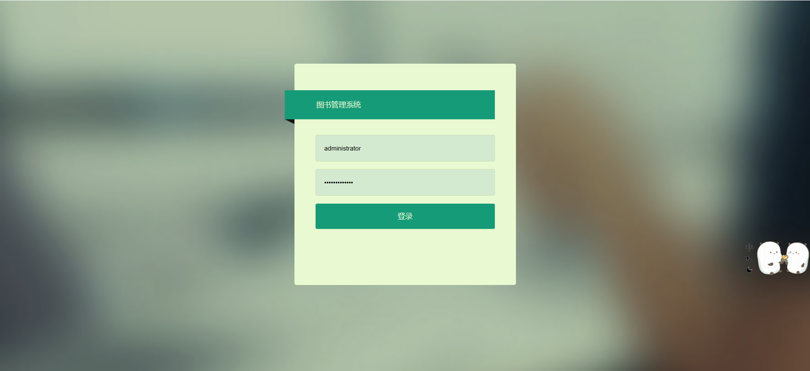
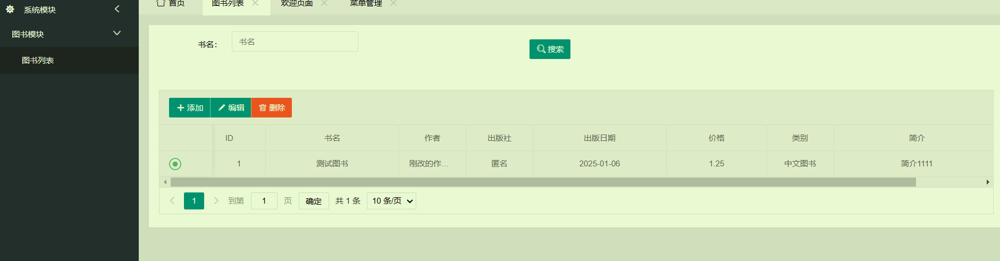
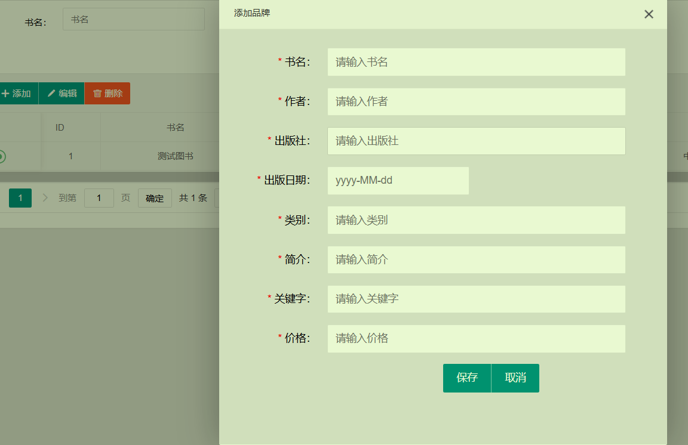
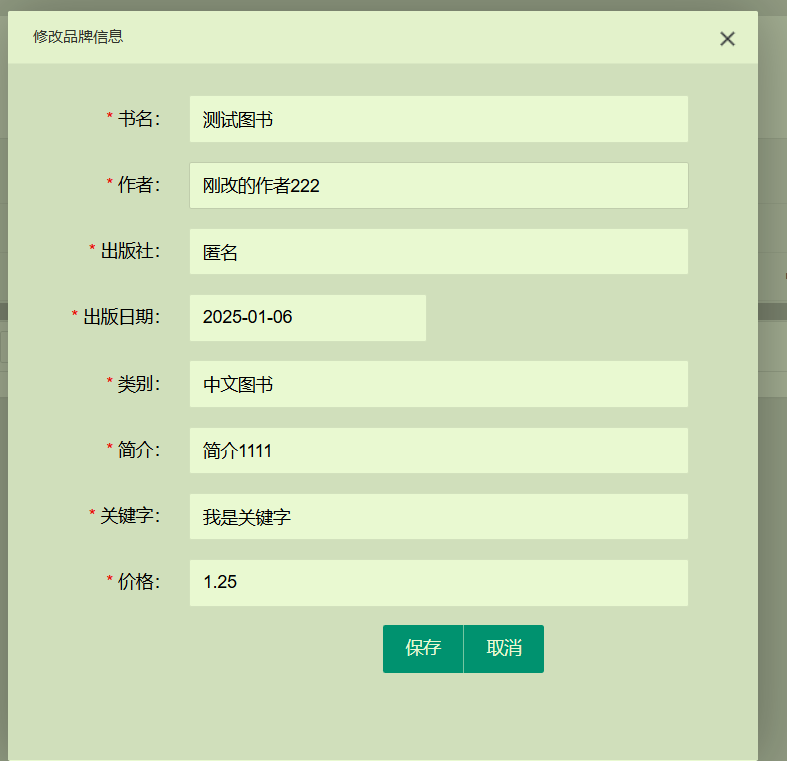
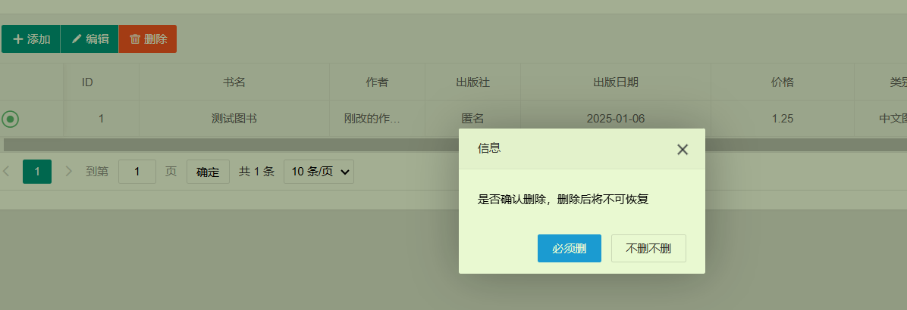
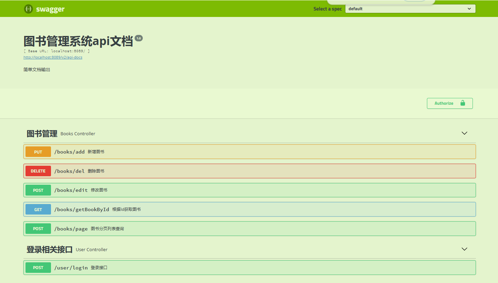
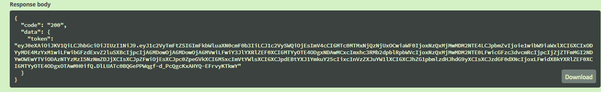
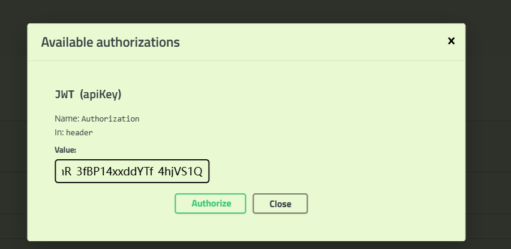
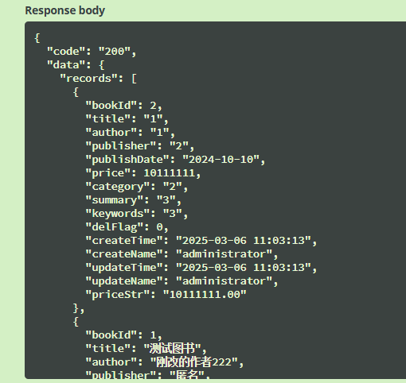

# 图书管理系统

## 部署流程

### 打包

```shell
# cmd shell命令
mvn clean package -Dmaven.test.skip=true
# powershell
mvn clean package "-Dmaven.test.skip=true"
#看环境运行其中一个
```

### 运行jar包

基于环境配置分离profile

```shell
#dev环境 服务端口 8089
java  -Dfile.encoding=UTF-8  -Dspring.profiles.active=dev -jar admin-core\target\admin-core-0.0.1.jar
#test环境
java  -Dfile.encoding=UTF-8  -Dspring.profiles.active=test -jar admin-core\target\admin-core-0.0.1.jar
#prod环境
java  -Dfile.encoding=UTF-8  -Dspring.profiles.active=prod -jar admin-core\target\admin-core-0.0.1.jar
```

## 项目描述

&#x20;按完整的项目来搭建应用框架，需体现登录权限控制、分层、日志、缓存、数据库(建议H2 ，以便部署)、基于环境的配置分离、swagger 等基本功能，并且提供页面操作。

## 项目架构

### 架构

前后端不分离，使用模板引擎渲染view层。

### 结构

*   admin-core 中分为business包（主要开发业务代码）、common包（公共包）、core（核心公共接口工具包）、system（系统管理），以上每个包都分层controller、service、mapper、entity，view等。
*   tools mybatis-plus开发手脚架。

### 框架

*   数据库：h2
*   后端：jdk8、springboot、springcache、mybatisPlus、thymeleaf（模板引擎）、slf4j、hikari、jwt
*   前端：模板引擎+layui.js+jquery.js

### 日志地址

logs 目录下 marubi\_all.log、marubi\_err.log

## web页面

### 地址
<http://localhost:8089/login>
### 登录密码
```用户名：administrator 密码：administrator```
### 演示截图





## 项目接口文档

### 文档地址

接口文档部署后访问

[http://localhost:8089/swagger-ui.html](http://localhost:8089/swagger-ui.html)

### 接口演示

手动调用用其他接口需要将user/login接口返回的token串传入header 的 Authorization：xxx；使用web页面使用websession-登录后将token信息封装到session带给前端。

如未登录则返回如下：

```json
{
  "code": "A0004",
  "info": "未登录"
}
```

如下图所示使用swagger调试接口





### 接口文档json

[api-json地址](http://localhost:8089/v2/api-docs)

