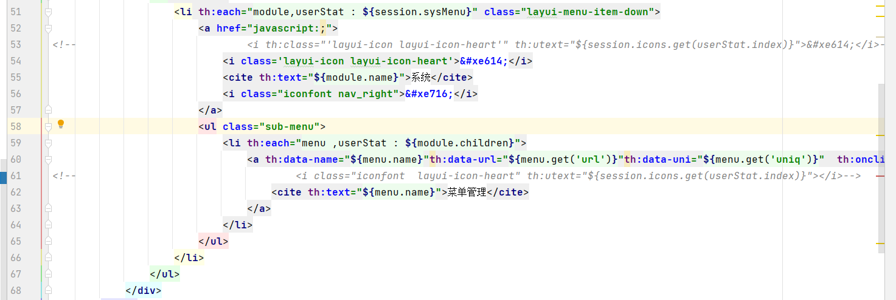
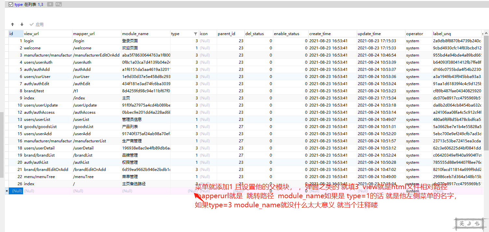
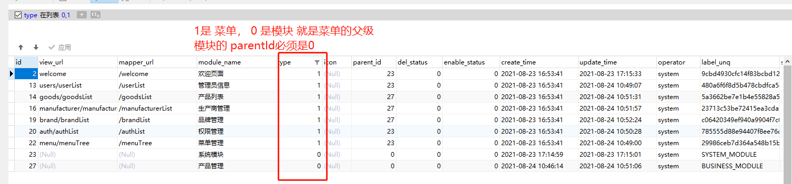
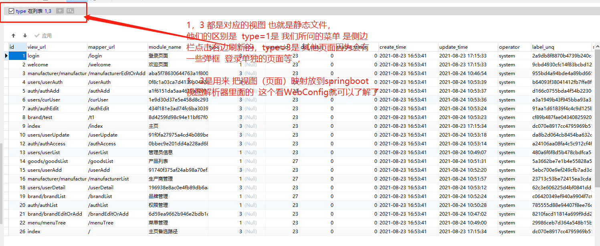
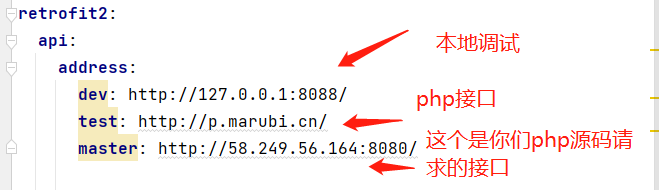

# menu1.0
## 菜单相关逻辑
#### 侧边栏显示逻辑+视图初始化
- 1 MenuServiceImpl&viewMenuList 初始化 菜单树形数据结构
- 2 UserController&login 登陆成功 调用 {viewMenuList}方法拿到树形结构数据，放到 session sysMenu 
- 3 UserController&login icon 图标  暂时没用到  有个bug 
- 4 看index.html  动态初始化左侧菜单栏
- 5 目前你要是想加视图 要加数据库然后重启项目 

#### 视图相关的  
##### 视图初始化 主要看  WebConfig.addViewControllers

## http 接口工具类
#### 相关配置及例子
- 1 RetrofitClientConfig 这个是配置类 测试的 ApiDemo url-dev 、请求你们线上的php接口ShopApiClient、shopApiMasterClient 老系统曾经调用的ip接口
- 2 相关配置文件  
- 3 SpringBootMyTest&post 有个例子 请求的你们php的
- retrofit2 http请求的工具，官方文档：https://square.github.io/retrofit/#restadapter-configuration

####### 文档先写到这里做个记录 后续再补充